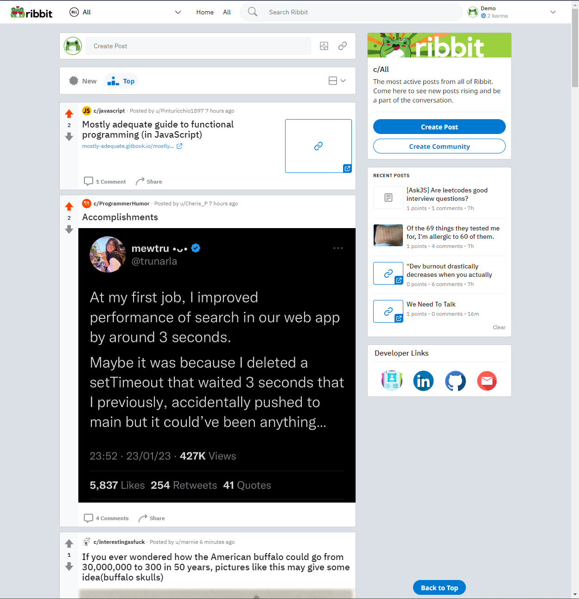
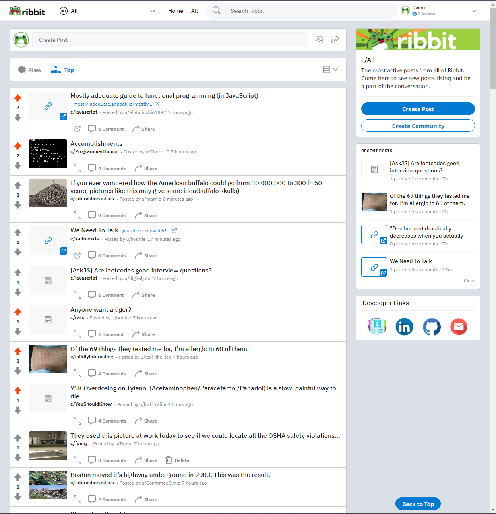
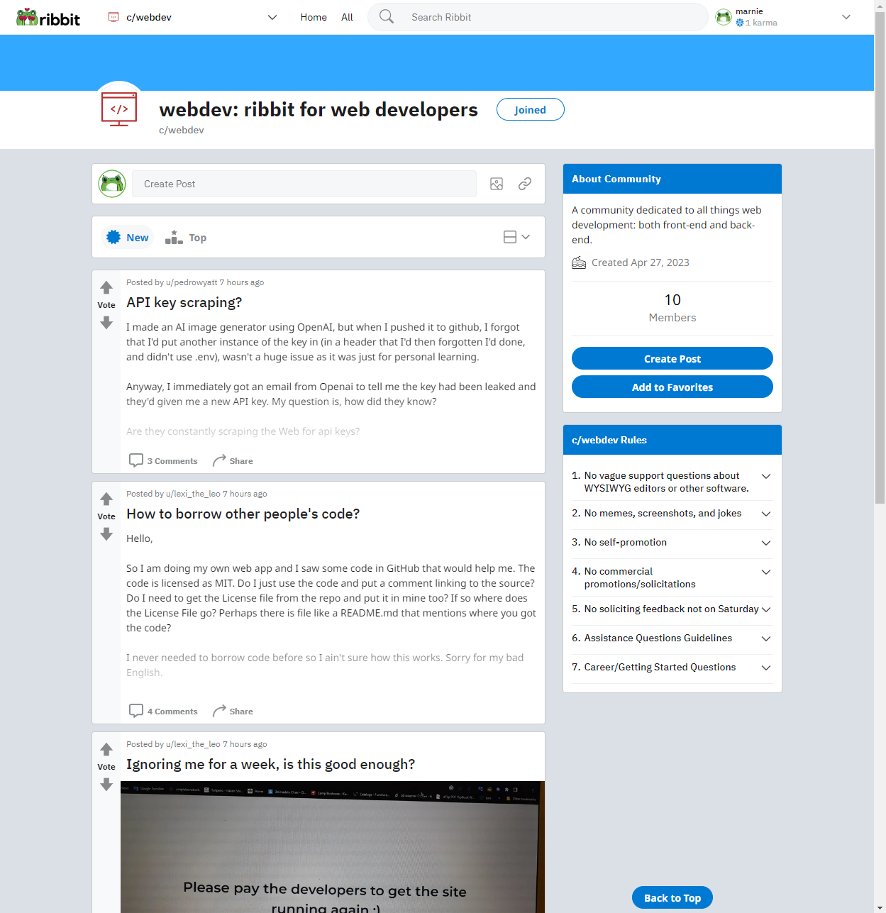
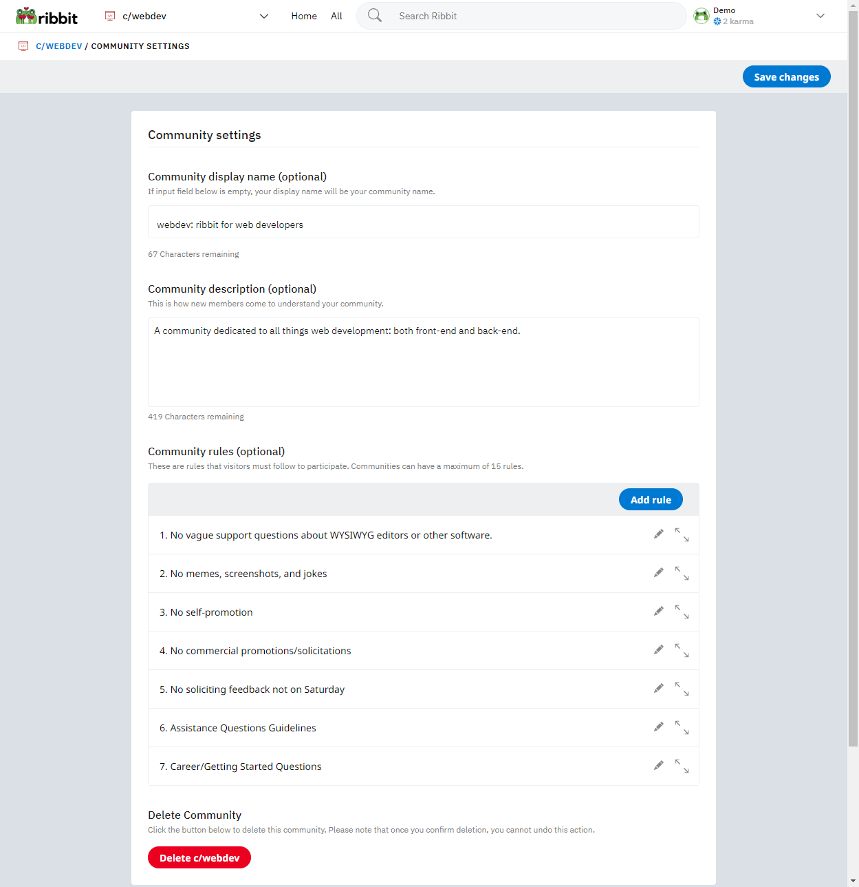
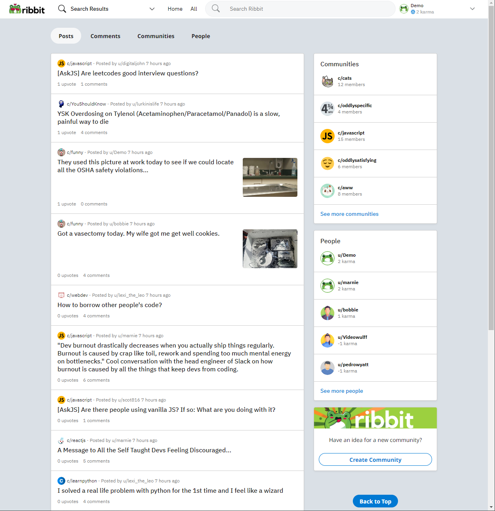
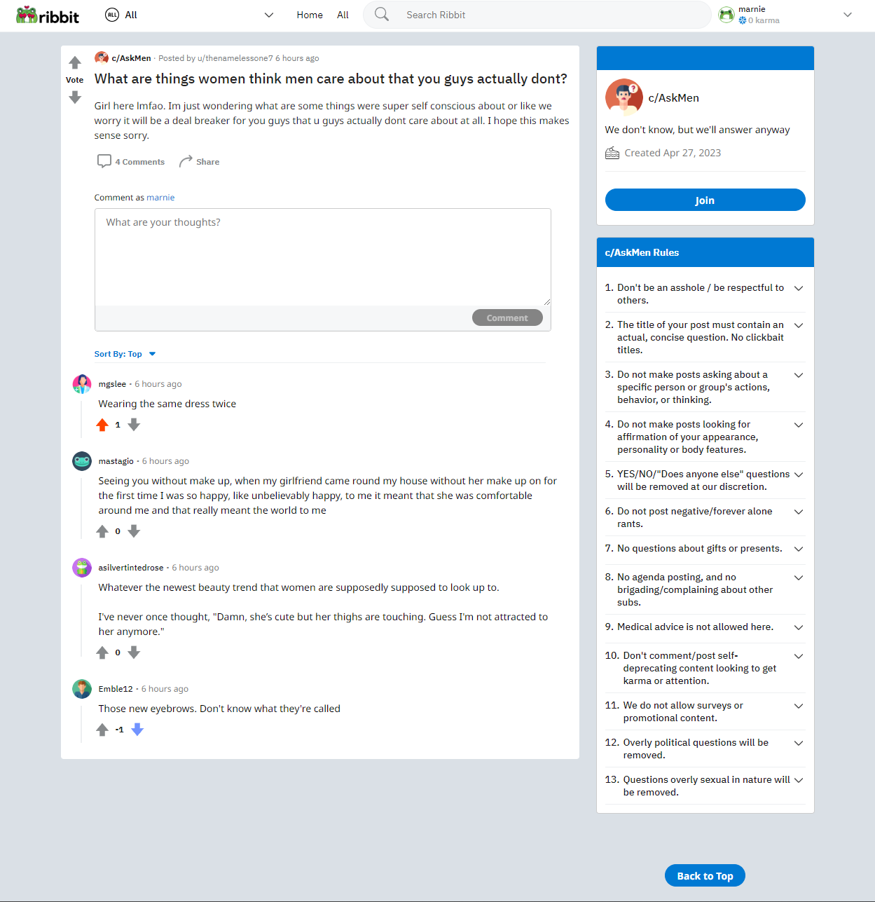
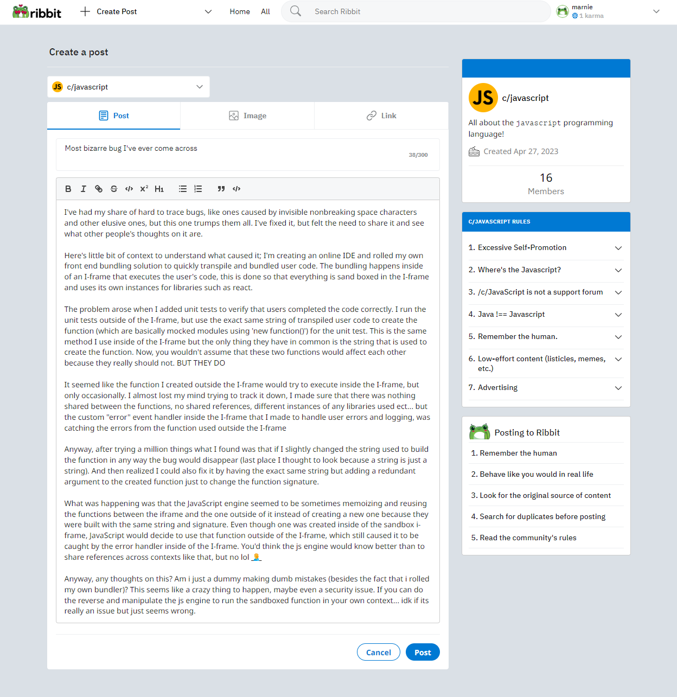
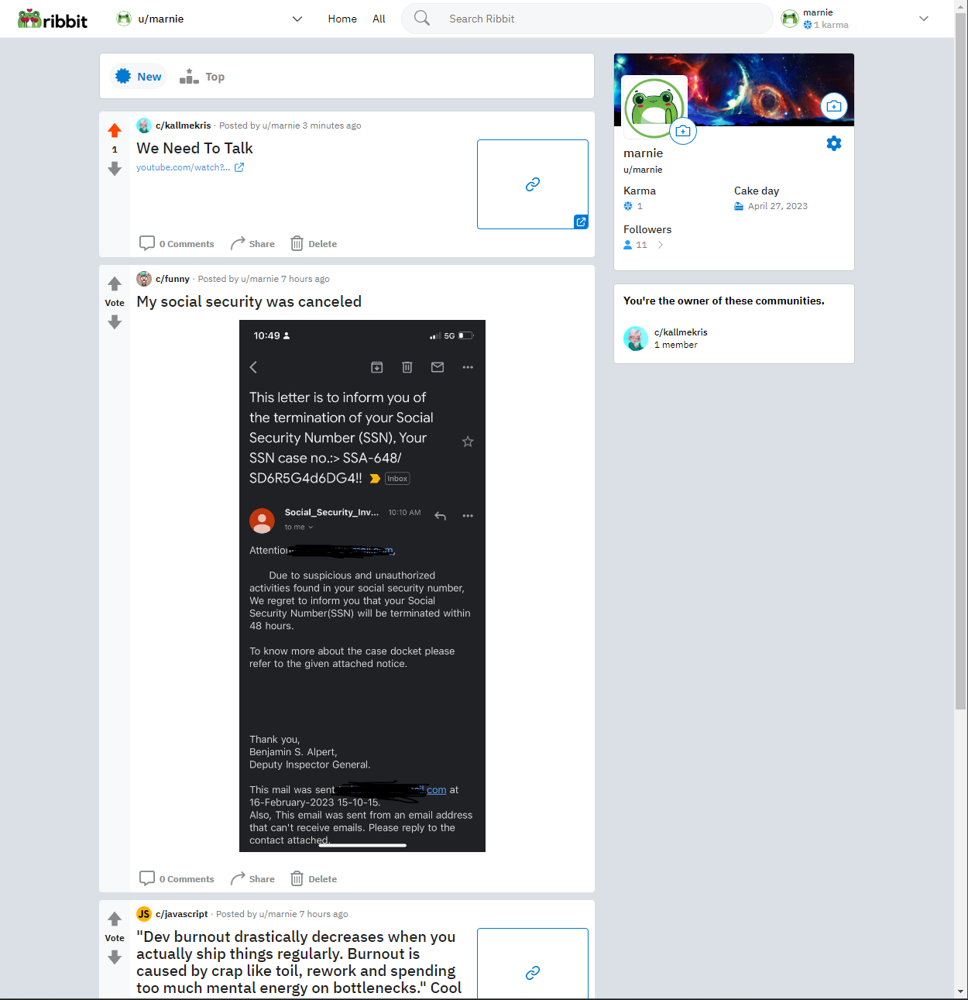
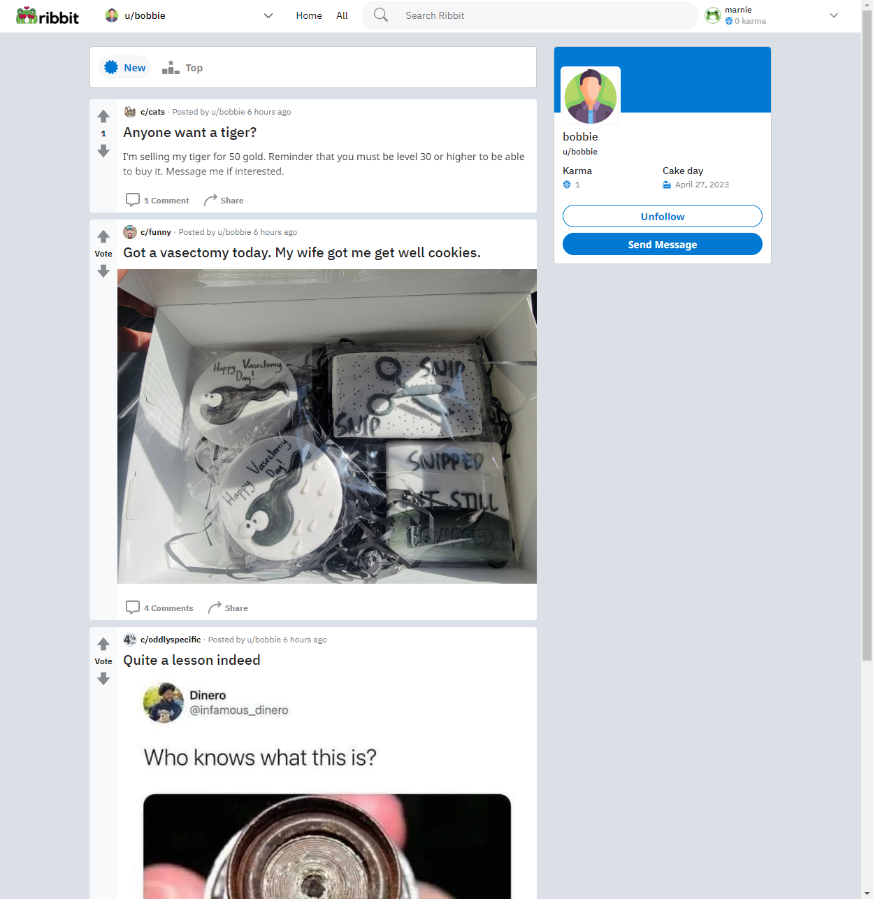

<p align="center">&nbsp;&nbsp;<svg width="50%" viewBox="0 0 70 23" fill="none" xmlns="http://www.w3.org/2000/svg"><path d="M0.367188 22V7.28906H4.56445V9.35352H4.63281C5.07031 8.78841 5.6582 8.26888 6.39648 7.79492C7.13477 7.31185 8.03255 7.07031 9.08984 7.07031C9.46354 7.07031 9.80078 7.10221 10.1016 7.16602C10.4023 7.22982 10.6211 7.29818 10.7578 7.37109L9.02148 11.5C8.93034 11.4544 8.76628 11.4043 8.5293 11.3496C8.30143 11.2949 8.04622 11.2676 7.76367 11.2676C7.30794 11.2676 6.8431 11.3815 6.36914 11.6094C5.89518 11.8281 5.49414 12.1745 5.16602 12.6484C4.84701 13.1133 4.6875 13.7103 4.6875 14.4395V22H0.367188ZM11.9473 22V7.28906H16.2676V22H11.9473ZM14.1211 5.60742C13.3737 5.60742 12.7448 5.35221 12.2344 4.8418C11.7331 4.33138 11.4824 3.71159 11.4824 2.98242C11.4824 2.23503 11.7331 1.61068 12.2344 1.10938C12.7448 0.598958 13.3737 0.34375 14.1211 0.34375C14.8594 0.34375 15.4792 0.598958 15.9805 1.10938C16.4909 1.61068 16.7461 2.23503 16.7461 2.98242C16.7461 3.71159 16.4909 4.33138 15.9805 4.8418C15.4792 5.35221 14.8594 5.60742 14.1211 5.60742ZM19.0703 22V0.945312H23.3906V8.54688H23.5C24.0286 8.07292 24.6257 7.70378 25.291 7.43945C25.9564 7.17513 26.6764 7.04297 27.4512 7.04297C28.554 7.04297 29.6068 7.33008 30.6094 7.9043C31.6211 8.47852 32.4414 9.33073 33.0703 10.4609C33.6992 11.5911 34.0046 12.9993 33.9863 14.6855C34.0046 15.9616 33.8314 17.0736 33.4668 18.0215C33.1022 18.9603 32.6055 19.7441 31.9766 20.373C31.3568 20.9928 30.6641 21.4577 29.8984 21.7676C29.1328 22.0684 28.3581 22.2188 27.5742 22.2188C26.7357 22.2188 25.9518 22.0547 25.2227 21.7266C24.4935 21.3893 23.8464 20.929 23.2812 20.3457H23.1855V22H19.0703ZM26.5625 18.6094C27.5195 18.6003 28.2988 18.2311 28.9004 17.502C29.502 16.7728 29.7936 15.8066 29.7754 14.6035C29.7936 13.3822 29.4928 12.4206 28.873 11.7188C28.2533 11.0169 27.4557 10.6706 26.4805 10.6797C25.5599 10.6706 24.7943 11.0124 24.1836 11.7051C23.582 12.3978 23.2767 13.3639 23.2676 14.6035C23.2767 15.8066 23.5911 16.7728 24.2109 17.502C24.8307 18.2311 25.6146 18.6003 26.5625 18.6094ZM36.0234 22V0.945312H40.3438V8.54688H40.4531C40.9818 8.07292 41.5788 7.70378 42.2441 7.43945C42.9095 7.17513 43.6296 7.04297 44.4043 7.04297C45.5072 7.04297 46.5599 7.33008 47.5625 7.9043C48.5742 8.47852 49.3945 9.33073 50.0234 10.4609C50.6523 11.5911 50.9577 12.9993 50.9395 14.6855C50.9577 15.9616 50.7845 17.0736 50.4199 18.0215C50.0553 18.9603 49.5586 19.7441 48.9297 20.373C48.3099 20.9928 47.6172 21.4577 46.8516 21.7676C46.0859 22.0684 45.3112 22.2188 44.5273 22.2188C43.6888 22.2188 42.9049 22.0547 42.1758 21.7266C41.4466 21.3893 40.7995 20.929 40.2344 20.3457H40.1387V22H36.0234ZM43.5156 18.6094C44.4727 18.6003 45.252 18.2311 45.8535 17.502C46.4551 16.7728 46.7467 15.8066 46.7285 14.6035C46.7467 13.3822 46.446 12.4206 45.8262 11.7188C45.2064 11.0169 44.4089 10.6706 43.4336 10.6797C42.513 10.6706 41.7474 11.0124 41.1367 11.7051C40.5352 12.3978 40.2298 13.3639 40.2207 14.6035C40.2298 15.8066 40.5443 16.7728 41.1641 17.502C41.7839 18.2311 42.5677 18.6003 43.5156 18.6094ZM53.0449 22V7.28906H57.3652V22H53.0449ZM55.2188 5.60742C54.4714 5.60742 53.8424 5.35221 53.332 4.8418C52.8307 4.33138 52.5801 3.71159 52.5801 2.98242C52.5801 2.23503 52.8307 1.61068 53.332 1.10938C53.8424 0.598958 54.4714 0.34375 55.2188 0.34375C55.957 0.34375 56.5768 0.598958 57.0781 1.10938C57.5885 1.61068 57.8438 2.23503 57.8438 2.98242C57.8438 3.71159 57.5885 4.33138 57.0781 4.8418C56.5768 5.35221 55.957 5.60742 55.2188 5.60742ZM62.1367 22V10.8438H58.9785V7.28906H62.1367V3.06445H66.457V7.28906H69.6016V10.8438H66.457V22H62.1367Z" fill="#67b54d"></path></svg></p>
<p align="center"><a href="https://ribbit-app.herokuapp.com/" target="_blank">Check out Ribbit here!</a></p>

## Table of Contents

- [Ribbit](#ribbit)
  - [Table of Contents](#table-of-contents)
  - [Project Information](#project-information)
  - [Languages, Frameworks, and Technologies](#languages-frameworks-and-technologies)
  - [Features](#features)
  - [Future Implementations](#future-implementations)
  - [Getting Started](#getting-started)
  - [Site Screenshots](#site-screenshots)
    - [All Feed Page](#all-feed-page)
    - [Classic Feed Mode](#classic-feed-mode)
    - [Community Page](#community-page)
    - ['Edit Community' Page](#edit-community-page)
    - [Edit Rules Section](#edit-rules-section)
    - [Search Results Page](#search-results-page)
    - [Single Post Page](#single-post-page)
    - [Create Post Page](#create-post-page)
    - [Current User Profile](#current-user-profile)
    - [Other User Profile](#other-user-profile)
  - [Developer Links](#developer-links)

## Project Information

(^ [Back to Top](#ribbit))

This is Ribbit, a clone of https://www.reddit.com. On this site, users can subscribe to communities that interest them and interact with other users by creating posts on communities, or by creating comments on other users' posts. Users can use their homepage to look through the posts from their subscribed communities, or the 'All' feed to view posts from all communities on the site. In addition, users can upload a profile image and a banner image on their profiles to represent themselves or their personalities. Owners of communities can customize the community's display name, description, image, and rules section.

## Languages, Frameworks, and Technologies

(^ [Back to Top](#ribbit))

- [React](https://beta.reactjs.org/)
- [Redux](https://redux.js.org/)
- [Python](https://www.python.org/)
- [JavaScript](https://devdocs.io/javascript/)
- [NodeJS](https://nodejs.org/en/docs/)
- [NPM](https://docs.npmjs.com/)
- [Flask](https://palletsprojects.com/p/flask/)
- [SQLAlchemy](https://www.sqlalchemy.org/)
- [Alembic](https://alembic.sqlalchemy.org/en/latest/)
- [PostgreSQL](https://www.postgresql.org/docs/)
- [Sqlite](https://www.sqlite.org/docs.html)
- [CSS3](https://devdocs.io/css/)
- [HTML5](https://devdocs.io/html/)
- [Git](https://devdocs.io/git/)

## Features

(^ [Back to Top](#ribbit))

- <strong>Sign-up and Login</strong>: Users may create their own accounts. They may log into their accounts after account creation.
  [All Feed Page](#all-feed-page)
- <strong>Communities</strong>: Users can create communities, edit the details of communities they've created, delete communities they've created, and view existing communities.
- <strong>Posts</strong>: Users can create posts (regular text posts, image posts, or link posts) under communities, edit posts, read posts, and delete posts.
- <strong>Comments</strong>: A user can reply to a post by leaving a comment underneath it. Users can also edit comments, read other users' comments, and delete comments.
- <strong>Community Subscriptions</strong>: Users can subscribe to communities, which a) puts the community on a list of subscribed communities for easy finding, and b) puts the community's posts on the user's homepage feed. Users can also unsubscribe from communities.
- <strong>Post Likes and Dislikes</strong>: Users can vote on posts by clicking either an 'upvote' button or a 'downvote' button. Users may also change or remove their vote at any time.
- <strong>Comment Likes and Dislikes</strong>: Users can vote on comments by clicking either an 'upvote' button or a 'downvote' button. Users may also change or remove their vote at any time.
- <strong>Community Rules</strong>: Community owners may create rules for their community. They can also edit or delete existing rules, and view rules on other communities.
- <strong>Followers</strong>: A user can 'follow' another user, which a) puts the followed user on a list of followed users for easy finding, and b) puts the followed user's posts on the following user's homepage feed. Users can find a list of the users they follow by opening the left dropdown menu in the navbar, and can see who is following them by going to their profile and clicking on 'Followers', which also displays the number of followers the user has (but is invisible to other users). Users may also be unfollowed.
- <strong>Favorite Communities</strong>: Once a community has been subscribed to, the user can open the left dropdown menu in the navbar to find it there. They can then click on the star located beside the community name, which favorites the community and bumps it to the 'Favorites' list at the top of the dropdown menu. Communities may also be unfavorited by clicking on the same star.
- <strong>Favorite Users</strong>: Once a user has been followed, the following user can open the left dropdown menu in the navbar to find them there. They can then click on the star located beside the user's name, which favorites the user and bumps them up to the 'Favorites' list at the top of the dropdown menu. Users may also be unfavorited by clicking on the same star.
- <strong>Viewed Posts</strong>: Clicking on a post automatically adds it to the 'Viewed Posts' list found on both the homepage feed and the 'All' feed. This list shows the last 5 viewed posts. Users can click a 'clear' button to delete all of the items in the list.
- <strong>Search</strong>: Users may use the searchbar at the top of the website to search for posts, comments, users, or communities. Once something is entered into the searchbar, a dropdown will appear showing related communities and users, and additional communities and users, as well as posts and comments, can be found by either pressing 'Enter' or clicking on the 'Search for <em>[query]</em>' button.
- AWS S3 used for:
  - User profile images
  - User banner images
  - Image posts
  - Community images

## Future Implementations

(^ [Back to Top](#ribbit))

I am currently working on:

- Notifications for messages
- Frontend for messages and notifications

Future feature implementations include:

- ~~More-developed search results page~~ &check;
- ~~Following other users~~ &check;
- ~~Favorite communities~~ &check;
- Improved navigation bar
  - ~~Left nav dropdown~~ &check;
  - Left nav sidebar
- ~~Advanced post formatting (on feeds)~~
- Saving posts and comments
- Static messaging
- Live messaging via websockets
- Notifications for post replies, comment replies, new community posts, new followers, and messages
- Nested comments

## Getting Started

(^ [Back to Top](#ribbit))

To set up this app:

1. Clone the project.
2. In the root directory of the project, run `pipenv install -r requirements.txt`.
3. Create a `.env` file based on the `.envexample` file provided.
4. Make sure the SQLite3 database connection URL is in the `.env` file
5. This starter organizes all tables inside the flask_schema schema, defined by the SCHEMA environment variable. Replace the value for SCHEMA with a unique name, making sure you use the snake_case convention.
6. Get into your `pipenv`, migrate your database, seed your database, and run your Flask app
   ```
   pipenv shell
   flask db upgrade
   flask seed all
   flask run
   ```
7. Switch to the react-app folder and run `npm install`

To run this app locally:

1. Navigate to the root directory of the project in the terminal and run `flask run`.
2. In a separate terminal, navigate to the `/react-app` directory and enter `npm start`. This should automatically launch a browser window navigated to the proper localhost address.
3. By default, the app will be running on port `3000`.

## Site Screenshots

(^ [Back to Top](#ribbit))

### All Feed Page



### Classic Feed Mode



### Community Page



### 'Edit Community' Page



### Edit Rules Section

<center></center>

### Search Results Page



### Single Post Page



### Create Post Page



### Current User Profile



### Other User Profile



## Developer Links

(^ [Back to Top](#ribbit))

- [Developer portfolio](https://www.saradunlop.dev)
- [LinkedIn](https://www.linkedin.com/in/sara-dunlop)
- [Wellfound](https://angel.co/u/sara-dunlop-1)
- [Github](https://www.github.com/Risclover)
