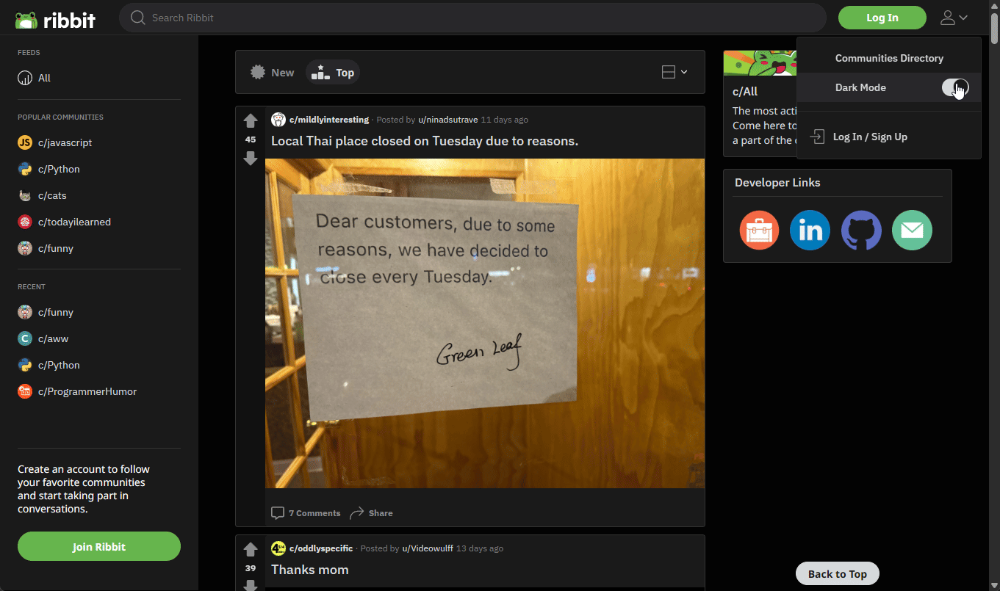

<p align="center"></p>
<p align="center"><a href="https://ribbit-app.herokuapp.com/" target="_blank">Check out Ribbit here!</a></p>

# Table of Contents

- [Project Information](#project-information)
- [Technology Stack](#technology-stack)
- [Features](#features)
- [Getting Started](#getting-started)
- [Developer Links](#developer-links)

# &nbsp;Project Information

(^ [Back to Top](#ribbit))

Welcome to Ribbit, one of the best full-stack pixel-perfect Reddit clones on the Internet!

Designed to mirror the Reddit experience, Ribbit not only offers Reddit’s core features like communities, posts, and comments, but also some of its more advanced features like live chat, content moderation (for community owners), and community page style customization, to name a few. In addition, a meticulous attention to detail and functional page interactions makes Ribbit look and feel like a complete experience for users despite being, at its core, "just a clone".

Interested in reading more about Ribbit and its development? Check out the [Ribbit Project Details](https://www.saradunlop.dev/project/ribbit) page located on my [portfolio site](https://www.saradunlop.dev)!

# &nbsp;Technology Stack

(^ [Back to Top](#ribbit))

Ribbit was built using the following tech stack:

- React
- Redux
- Flask
- SQLAlchemy
- Flask-SocketIO (WebSockets, for real-time communication)
- AWS S3 (for image uploads)

# &nbsp;Features

(^ [Back to Top](#ribbit))

Ribbit contains a long list of features, so buckle in!

## User Features

### Multiple Ways to Log In

<p align="center"></p>

Users are able to create accounts of their own or log in using an existing Google account. There is also a Demo account available for public access for the purpose of touring Ribbit and testing its features.

### User Accounts & Profiles

<p align="center"></p>

Each user has their own profile page, and may customize details such as their profile picture, banner, display name, and description.

## Community Features

### Communities

<p align="center"></p>

Reddit’s subreddits are Ribbit’s communities, and just as on Reddit, users on Ribbit are free to create communities of their own. Each community has its own page, where users can find information about that community as well as rules, posts, and more.

### Subscriptions

<p align="center"></p>

Users are able to subscribe to communities of interest. In doing so, that community’s posts are automatically added to the user’s homepage feed for the duration of their subscription. The other benefit of subscribing to a community is ease of access, as it adds the community to the user’s Subscriptions list, which is available for navigation as well as creating new posts.

### Community Rules

<p align="center"></p>

Community owners can set rules for their community to guide them on wwhat is, or isn't, allowed when posting and commenting.

### Community Moderation

   <p align="center"></p>

Although not as involved or intense as Reddit’s mod system, Ribbit does allow community owners to manage the content posted and commented in their community, enabling them to delete content that doesn’t abide by the community’s rules.

### Community Page Style

<p align="center"></p>

Community owners have access to their community’s style settings, giving them the freedom to customize aspects like the community’s theme colors, banner, background, and more.

## Post Features

### Posts

Users can create 3 types of posts:

#### Text Posts

Comes with a “WYSIWYG” editor for easy visual formatting

<p align="center"></p>

#### Image Posts

<p align="center"></p>

#### URL/Link posts

<p align="center"></p>

### Post Feeds

Post feeds on Ribbit have infinite scrolling, allowing the user to continue browsing without interruption. There are a few types of post feeds:

1.  **Homepage feed:** Customizable, as it includes posts from the user’s subscribed communities and followed users.
2.  **‘All’ feed:** Contains all posts from all communities across Reddit.
3.  **Community feed:** A community’s post feed, containing only that community’s posts, found on that community’s page.
4.  **User feed:** A user’s post feed, containing only that user’s posts, found on that user’s profile page.

<p align="center"></p>

In addition to infinite scrolling, post feeds also offer ways to sort the feed as well as 3 different feed formats, ranging from “Card” (which is the default/”normal” format) to “Compact”.

### Recently Viewed Posts

<p align="center"></p>

Users can find a list of up to 5 of their most recently viewed posts on their homepage and 'All' feeds.

## Comment Features

### Comments

<p align="center"></p>

Located on a post’s page beneath the post itself is its comments section. Users are able to sort comments in a variety of ways. Comments are nested, meaning users can directly reply to other comments.

### Comment Votes

### Comment Search

<p align="center"></p>

All comment sections include a mini search feature for finding comments with a specific search query within that comment section.

## Live Chat Features

### Live Chat

<p align="center"></p>

For real-time communication, users can use the live chat feature, which allows them to chat directly with other users, one-on-one.

### Reactions

Within the live chat feature, users can “react” to each others’ messages with cute, frog-themed animations.

### GIFs & Emojis

<p align="center"></p>

Users have access to an entire library of GIFs at their disposal. There is also a healthy supply of frog-themed emojis.

### Notifications

The live chat feature notifies the user when they have any unread chat threads. Live chat notifications helpfully update in real time.

## Misc. Features

### Light/Dark Mode Toggle

<p align="center"></p>

Perpetual dark mode user? The light/dark mode toggle allows users to change Ribbit’s theme according to preference.

### Voting System (Posts & Comments)

<p align="center"></p>

Users can express their opinions by voting on posts and comments with either an upvote (which generally implies a positive reaction or agreement) or a downvote (whi generally implies a negative reaction or disagreement). The more points a post or comment has, the more it is likely to be seen by users, and the better received it tends to be.

A user's total score (upvotes minus downvotes across all posts and comments they have authored) appears as the user's "karma". When a user has a higher karma score, they give off a perception that they have been around Ribbit for a while, and contribute content that is well-received by others.

### Search

Located in the navbar at the top of every page is Ribbit’s search bar, which enables users to find specific or relevant posts, comments, communities, and users.

<p align="center"></p>

Typing a search query into the search bar brings up the quick results menu, showing 5 relevant users and communities. Full search results (which include post and comment results) can be viewed either by pressing the `Enter` key after typing in the query, or by clicking the `Search for "(query)"` button at the bottom of the quick results menu (shown at the bottom of the above screenshot).

### Messages

All users have their very own message inbox, allowing them to send and receive messages. Their inbox also has sections for viewing post replies.

### Followers

<p align="center"></p>

Users may follow other users that they enjoy or find interesting. In doing so, they will find that user’s posts on their homepage feed. In addition, the followed user is added to the following user’s “Followers” list, which is located in the left nav menu for easy navigation. As a side note, users can view a list of the users following them by going to their own profile page and clicking on the ‘Followers’ statistic in the right column box.

### Favorites

<p align="center"></p>

Subscribed communities and followed users may be “favorited”. This adds the community or user to a special “Favorites” list at the top of the left navbar for easy navigation.

# &nbsp;Getting Started

## To set up this app:

1. Clone the project.
2. In the root directory of the project, run `pipenv install -r requirements.txt`.
3. Create a `.env` file based on the `.envexample` file provided.
4. Make sure the SQLite3 database connection URL is in the `.env` file.
5. This starter organizes all tables inside the `flask_schema` schema, defined by the SCHEMA environment variable. Replace the value for SCHEMA with a unique name, making sure you use the `snake_case` convention.
6. Get into your `pipenv`, migrate your database, seed your database, and run your Flask app:

   ```
   pipenv shell
   flask db upgrade
   flask seed all
   flask run
   ```

7. Switch to the react-app folder and run `npm install`.

## To run this app locally:

1. Navigate to the root directory of the project in the terminal and run `flask run`.
2. In a separate terminal, navigate to the `/react-app` directory and enter `npm start`. This should automatically launch a browser window navigated to the proper localhost address.
3. By default, the app will be running on port `3000`.

# &nbsp;Developer Links

- [Portfolio Website](https://www.saradunlop.dev)
- [Ribbit Project Page](https://www.saradunlop.dev/projects/ribbit)
- [Blog](https://www.saradunlop.dev/blog)
- [LinkedIn Page](https://www.linkedin.com/en/sara-dunlop-1)
