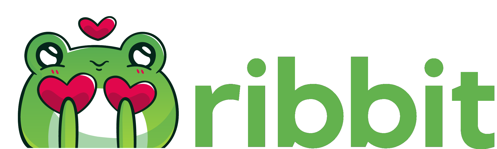
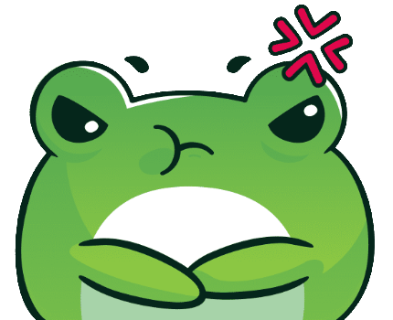
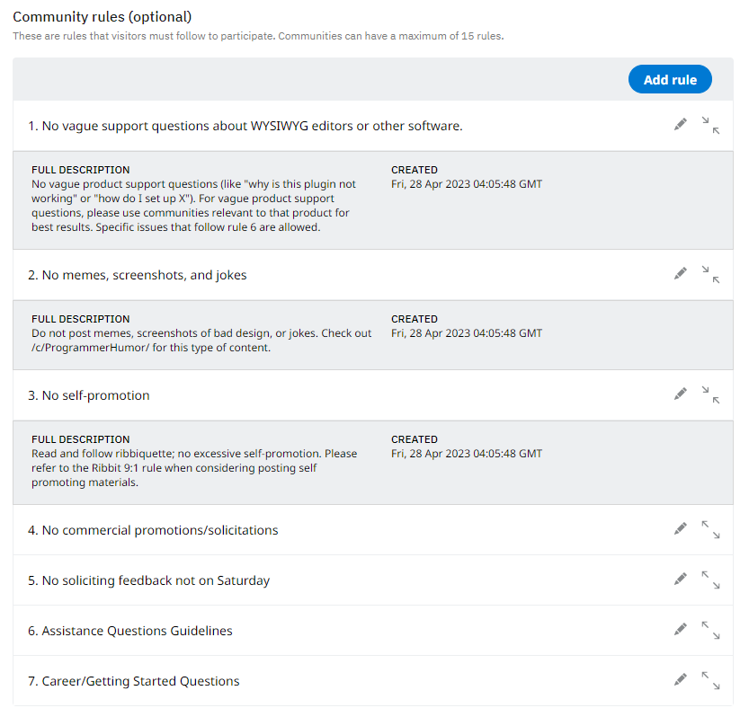

<p align="center"></p>
<p align="center"><a href="https://ribbit-app.herokuapp.com/" target="_blank">Check out Ribbit here!</a></p>

# Table of Contents

- [Project Information](#project-information)
- [Languages, Frameworks, and Technologies](#languages-frameworks-and-technologies)
- [Features](#features)
- [Future Implementations](#future-implementations)
- [Getting Started](#getting-started)
- [Site Screenshots](#site-screenshots)
  - [All Feed Page](#all-feed-page)
  - [Classic Feed Mode](#classic-feed-mode)
  - [Community Page](#community-page)
  - ['Edit Community' Page](#edit-community-page)
  - [Edit Rules Section](#edit-rules-section)
  - [Search Results Page](#search-results-page)
  - [Single Post Page](#single-post-page)
  - [Create Post Page](#create-post-page)
  - [Current User Profile](#current-user-profile)
  - [Other User Profile](#other-user-profile)
- [Developer Links](#developer-links)

# &nbsp;Project Information

(^ [Back to Top](#ribbit))

This is Ribbit, a clone of <a href="https://www.reddit.com">https://www.reddit.com</a>. On this site, users can subscribe to communities that interest them and interact with other users by creating posts on communities, or by creating comments on other users' posts. Users can use their homepage to look through the posts from their subscribed communities, or the 'All' feed to view posts from all communities on the site. In addition, users can upload a profile image and a banner image on their profiles to represent themselves or their personalities. Owners of communities can customize the community's display name, description, image, and rules section.

# &nbsp;Languages, Frameworks, and Technologies

(^ <a href="#ribbit">Back to Top</a>)

Ribbit was made with primarily the following technologies:

- <a href="https://beta.reactjs.org" target="_blank">React.js</a>
- <a href="https://redux.js.org" target="_blank">Redux</a>
- <a href="https://palletsprojects.com/p/flask/" target="_blank">Flask</a>
- <a href="https://www.sqlalchemy.org/" target="_blank">SQLAlchemy</a>
- <a href="https://flask-socketio.readthedocs.io/en/latest/" target="_blank">Flask-SocketIO</a>
- <a href="https://devdocs.io/css/" target="_blank">CSS3</a>

# &nbsp;Features

(^ [Back to Top](#ribbit))

- <strong>Sign-up and Login</strong>: Users may create their own accounts. They may log into their accounts after account creation.
- <strong>Communities</strong>: Users can create communities, edit the details of communities they've created, delete communities they've created, and view existing communities.
- <strong>Posts</strong>: Users can create posts (regular text posts, image posts, or link posts) under communities, edit posts, read posts, and delete posts.
- <strong>Comments</strong>: A user can reply to a post by leaving a comment underneath it. Users can also edit comments, read other users' comments, and delete comments.
- <strong>Community Subscriptions</strong>: Users can subscribe to communities, which a) puts the community on a list of subscribed communities for easy finding, and b) puts the community's posts on the user's homepage feed. Users can also unsubscribe from communities.
- <strong>Post Likes and Dislikes</strong>: Users can vote on posts by clicking either an 'upvote' button or a 'downvote' button. Users may also change or remove their vote at any time.
- <strong>Comment Likes and Dislikes</strong>: Users can vote on comments by clicking either an 'upvote' button or a 'downvote' button. Users may also change or remove their vote at any time.
- <strong>Community Rules</strong>: Community owners may create rules for their community. They can also edit or delete existing rules, and view rules on other communities.
- <strong>Followers</strong>: A user can 'follow' another user, which a) puts the followed user on a list of followed users for easy finding, and b) puts the followed user's posts on the following user's homepage feed. Users can find a list of the users they follow by opening the left dropdown menu in the navbar, and can see who is following them by going to their profile and clicking on 'Followers', which also displays the number of followers the user has (but is invisible to other users). Users may also be unfollowed.
- <strong>Favorite Communities</strong>: Once a community has been subscribed to, the user can open the left dropdown menu in the navbar to find it there. They can then click on the star located beside the community name, which favorites the community and bumps it to the 'Favorites' list at the top of the dropdown menu. Communities may also be unfavorited by clicking on the same star.
- <strong>Favorite Users</strong>: Once a user has been followed, the following user can open the left dropdown menu in the navbar to find them there. They can then click on the star located beside the user's name, which favorites the user and bumps them up to the 'Favorites' list at the top of the dropdown menu. Users may also be unfavorited by clicking on the same star.
- <strong>Viewed Posts</strong>: Clicking on a post automatically adds it to the 'Viewed Posts' list found on both the homepage feed and the 'All' feed. This list shows the last 5 viewed posts. Users can click a 'clear' button to delete all of the items in the list.
- <strong>Search</strong>: Users may use the searchbar at the top of the website to search for posts, comments, users, or communities. Once something is entered into the searchbar, a dropdown will appear showing related communities and users, and additional communities and users, as well as posts and comments, can be found by either pressing 'Enter' or clicking on the 'Search for <em>[query]</em>' button.
- AWS S3 used for:
  - User profile images
  - User banner images
  - Image posts
  - Community images

# &nbsp;Future Implementations

(^ [Back to Top](#ribbit))

I am currently working on:

- Notifications for messages
- Frontend for messages and notifications

Future feature implementations include:

- ~~More-developed search results page~~ &check;
- ~~Following other users~~ &check;
- ~~Favorite communities~~ &check;
- Improved navigation bar
  - ~~Left nav dropdown~~ &check;
  - Left nav sidebar
- ~~Advanced post formatting (on feeds)~~
- Saving posts and comments
- Static messaging
- Live messaging via websockets
- Notifications for post replies, comment replies, new community posts, new followers, and messages
- Nested comments

# &nbsp;Getting Started

(^ [Back to Top](#ribbit))

To set up this app:

1. Clone the project.
2. In the root directory of the project, run `pipenv install -r requirements.txt`.
3. Create a `.env` file based on the `.envexample` file provided.
4. Make sure the SQLite3 database connection URL is in the `.env` file
5. This starter organizes all tables inside the flask_schema schema, defined by the SCHEMA environment variable. Replace the value for SCHEMA with a unique name, making sure you use the snake_case convention.
6. Get into your `pipenv`, migrate your database, seed your database, and run your Flask app
   ```
   pipenv shell
   flask db upgrade
   flask seed all
   flask run
   ```
7. Switch to the frontend folder and run `npm install`

To run this app locally:

1. Navigate to the root directory of the project in the terminal and run `flask run`.
2. In a separate terminal, navigate to the `/frontend` directory and enter `npm start`. This should automatically launch a browser window navigated to the proper localhost address.
3. By default, the app will be running on port `3000`.

# &nbsp;Site Screenshots

(^ [Back to Top](#ribbit))

## All Feed Page


## Classic Feed Mode


## Community Page


## 'Edit Community' Page


## Edit Rules Section

<center></center>

## Search Results Page


## Single Post Page


## Create Post Page


## Current User Profile


## Other User Profile


## &nbsp;Developer Links

(^ [Back to Top](#ribbit))

- [Developer portfolio](https://www.saradunlop.dev)
- [LinkedIn](https://www.linkedin.com/in/sara-dunlop)
- [Wellfound](https://angel.co/u/sara-dunlop-1)
- [Github](https://www.github.com/Risclover)
